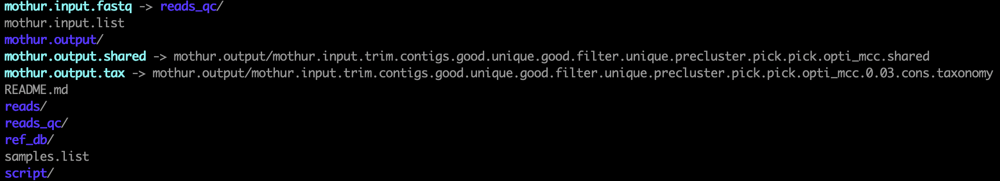

Mothur analysis project outline
===============================

Directories and files
---------------------

* `reads/`: directory of all raw fastq files
* `reads_qc/`: directory of qc'd fastq files
* `mothur.input.fastq`: symlink to either `reads/` or `reads_qc`
* `mothur.input.list`: file used as `mothur` input
* `mothur.output/`: `mothur` output directory
* `mothur.output.shared`: symlink to `*.shared` file from `mothur` output
* `mothur.output.tax`: symlink to `*.tax` file from `mothur` output
* `script/`: directory of all scripts
* `ref_db/`: directory of reference database
