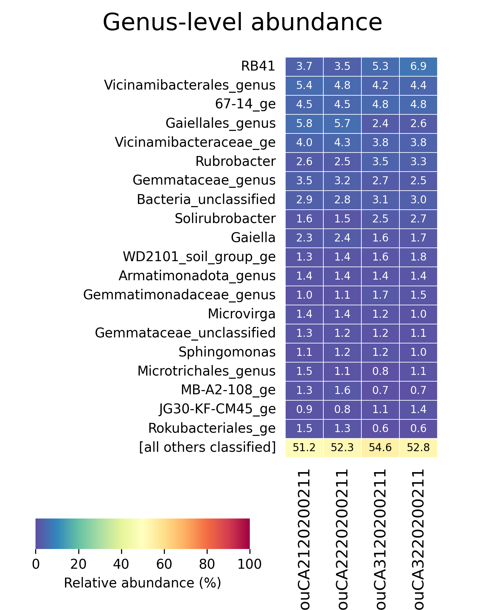
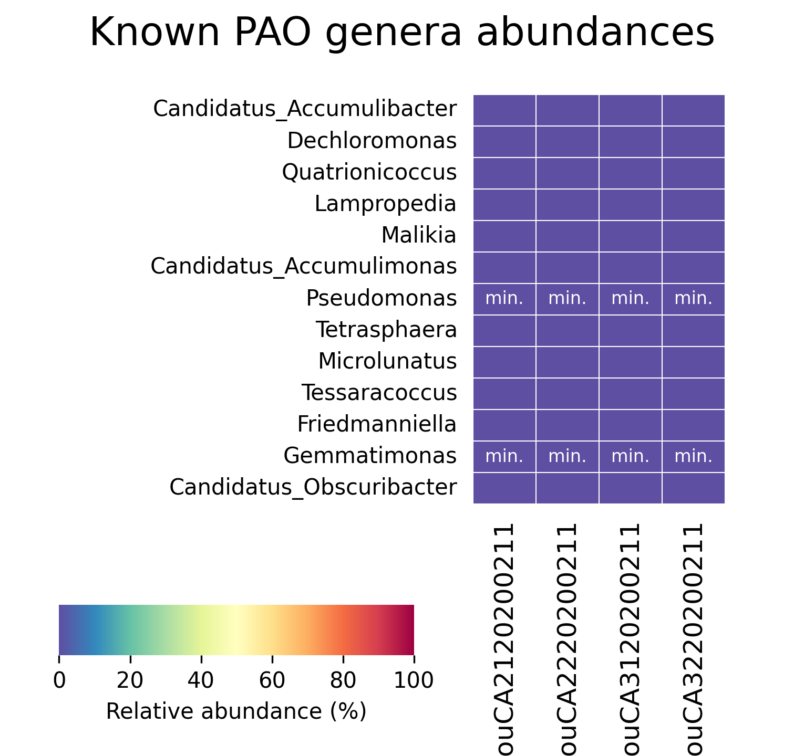

This is a tutorial for executing 16S SOP using mothur, based on the protocol
	that Varun Srinivasan has developed in 2017 for our group.


# 1. Skill requirements

## 1.1 Linux/bash

The original protocol was developed to be run on Linux natively with
	command-line interface (CLI).
Therefore, this tutorial assumes the learners have elementary bash skills,
	including:

* be familiar with CLI (important)
* make, remove and navigate through directories
* the concept of working directory, relative and absolute paths
* create, delete and edit files, particularly text files
* call a program and pass arguments to it
* [recommended] text editor with text interface, such as vi/vim/nano/emacs etc, or you'll have problem editing files remotely
* [optional] `$PATH` and other environmental variables
* [optional] `sed` and `grep` with regular expression skills

For Linux users, sh/bash is usually the default shell.
For MacOS users, zsh is the default shell since macOS 10.15 Catalina, but it
	should be very similar to sh/bash and usually require no adaption.
For Windows users (though very discouraged), there are several solutions:

* [Windows Subsystem for Linux (WSL)](https://docs.microsoft.com/en-us/windows/wsl/install-win10) is a bundled feature for Windows 10, though needs manual enabling (recommended as for today)
* [Cygwin](https://www.cygwin.com/)
* Log into a remote server that runs Linux using ssh (such as [PuTTY](https://www.putty.org/))

P/S: Mothur should have a GUI (graphical user interface) since version v1.29.0 or so,
	but that was not, and will never be included in this tutorial
	(and don't ask me why... there are multiple reasons).
Learners may play with the GUI version if they want.

## 1.2 Remote access

Not all 16S datasets can be processed by a laptop or household desktop.
High performance compution (HPC) including dedicated workstation, HPC cluster
	or cloud computing is required more those juggernaut datasets.
In such cases, remote access to such computers and related skills are required.

## 1.3 Pitfalls for Windows users

* file names starting with a dot will bring immersively more pain than on Linux/MacOS
* Windows uses reverse-slash (\\) as directory separator, while Linux/MacOS uses slash (/); many programming languages can handle this difference and allow use of slash in a compatibly
* Windows uses '\\r\\n' as end-of-line (EOL) while Linux/current MacOS uses '\\n'; this may cause some text files shown as a huge single-line chunk, particularly with Windows' default text editor `notepad.exe`; note most text editor for programmers can deal with this problem

## <font color="#FF0000">1.4 File naming scheme</font>

<b>Change your style of naming files.</b>
Though Linux accepts all characters except slash (/) in file name,
	it is <b>required</b> to follow below naming scheme in this tutorial:

* No special characters in file names. Any characters except alphabetical (a-z and A-Z), digits (0-9), underscore (\_), dot (.) are considered special characters. <font color="#FF0000">Common practice violating this convention: parentheses, spaces, unicode characters (such as Chinese-Japanese-Korean characters and non-standard alphabetical letters used in European languages).</font>
* Does NOT start with a dot (.)
* Less than 255 bytes, which is a hard limit on Linux platforms.

Violating this naming scheme can potentially result in failed program executions
	or even loss of data.


# 2. Software preparation

This SOP uses three software, `sickle`, `mothur` and `python`.

## 2.1 `sickle`

Source code is downloadable at [https://github.com/najoshi/sickle](https://github.com/najoshi/sickle).
Unfortunately, this program seems have no prebuilt binaries.
To install sickle, one needs to download the code from above repository and
	build as described in `README.md`.
A C compiler and a `gmake`-compatible make system is required.
On Linux, these tools are usually readily available or can be easily installed.
On MacOS and Windows, please ask an expert for help if you are not familiar with
	building software from source.

## 2.2 `mothur`

Project repository can be found at [https://github.com/mothur/mothur](https://github.com/mothur/mothur).
Check the release page to download prebuilt binaries (the easiest way),
	but I'll not try to stop you if you want to build it from source
	(usually intended for very specific customizations).

Note: you'll also need `uchime` and `vsearch` from tools to run the full SOP.

## 2.3 `python` (optional)

Python is mainly used in downstream analysis and plotting in this pipeline.
It is not required for those use their own analysis and plotting methods.

Python can be downloaded at [https://www.python.org/downloads/](https://www.python.org/downloads/),
	version 3.8 or newer is recommended (at least 3.7 imo), but never 2.7
	(or older).
You'll also need some packages to run the analysis and plotting scripts:

* numpy (and its dependencies)
* matplotlib (and its dependencies)

Install packages with `pip` will automatically resolve the dependencies.

## 2.4 Calling programs

Make sure that below program calls do not end up in `Command not found` error:

```bash
$ sickle
$ mothur
$ uchime
$ vsearch
$ python
```

This requires above programs are in `$PATH`.
If you decide to install these programs in other paths (like I did),
	make sure you know how and where to call them,
Particularly, make sure that `mothur` can find `uchime` and `vsearch`.


# 3. Environment preparation

## 3.1 Main analysis working directory

Check out my repository [https://github.com/lguangyu/Amplicon_Sequencing_Analysis/tree/anal_proj_struct](https://github.com/lguangyu/Amplicon_Sequencing_Analysis/tree/anal_proj_struct),
	download as a zip file and extract all contents, and rename the extracted
	directory as `mothur_sop_tutorial`.

If you have git installed, it is as easy running below code:
```bash
$ git clone -b anal_proj_struct git@github.com:lguangyu/Amplicon_Sequencing_Analysis.git
$ mv Amplicon_Sequencing_Analysis mothur_sop_tutorial
```

You'll see a newly created directory similar as:
<pre>
<font color="#5555FF"><b>mothur_sop_tutorial/</b></font>
├── <font color="#5555FF"><b>analysis_script</b></font>
├── <font color="#5555FF"><b>auxiliary</b></font>
│   └── <font color="#FF55FF"><b>dirs_and_files.png</b></font>
├── <font color="#FF5555"><b>mothur.input.fastq</b></font>
├── mothur.input.list
├── <font color="#FF5555"><b>mothur.output.count_table</b></font>
├── <font color="#FF5555"><b>mothur.output.dist</b></font>
├── <font color="#FF5555"><b>mothur.output.fasta</b></font>
├── <font color="#FF5555"><b>mothur.output.list</b></font>
├── <font color="#FF5555"><b>mothur.output.shared</b></font>
├── <font color="#FF5555"><b>mothur.output.tax</b></font>
├── README.md
├── samples.list
├── <font color="#5555FF"><b>script</b></font>
│   ├── abundance_analysis.sh
│   ├── clean_up.sh
│   ├── <font color="#55FF55"><b>link_ref_db.sh</b></font>
│   ├── <font color="#55FF55"><b>make_mothur_input.sh</b></font>
│   ├── <font color="#55FF55"><b>make_mothur_silver_reference_files.py</b></font>
│   ├── mothur.oligo.script
│   ├── mothur.script
│   ├── <font color="#55FF55"><b>pack_output_lite.sh</b></font>
│   ├── <font color="#55FF55"><b>pack_output.sh</b></font>
│   └── <font color="#55FF55"><b>preprocess.sh</b></font>
└── <font color="#5555FF"><b>tutorial</b></font>
    ├── <font color="#5555FF"><b>img</b></font>
    ├── tutorial.html
    └── tutorial.Rmd
</pre>

The neon blue color indicates directories, and red for broken symbolic links.
Those symbolic links will become alive as we go down this pipeline.
This directory is our working directory and all below codes will be called
	here.

## 3.2 Downstream analysis scripts

Similar to 3.1, check out and download the scripts at [https://github.com/lguangyu/MothurAmpliconTablePlot](https://github.com/lguangyu/MothurAmpliconTablePlot),
	and extract the content into `analysis_script`.

If you have git installed, it is as easy running below code:
```bash
$ git submodule update
```

You'll see a stuffed `analysis_script` directory as:
<pre>
<font color="#5555FF"><b>analysis_script/</b></font>
├── <font color="#5555FF"><b>data</b></font>
│   ├── gao.family.stokholm_et_al_2017.txt
│   ├── gao.genus.stokholm_et_al_2017.txt
│   ├── pao.family.stokholm_et_al_2017.txt
│   └── pao.genus.stokholm_et_al_2017.txt
├── <font color="#55FF55"><b>get_mothur_taxonomy_abundance.py</b></font>
├── LICENSE
├── <font color="#55FF55"><b>plot_mothur_taxonomy_abundance.py</b></font>
├── <font color="#5555FF"><b>pylib</b></font>
│   ├── file_util.py
│   ├── __init__.py
│   ├── shared_table.py
│   └── taxonomy.py
└── README.md
</pre>


# 4. Data preparation

## 4.1 Expected sequencing reads format

Raw sequencing reads are assumed in [fastq](https://en.wikipedia.org/wiki/FASTQ_format) format,
	paired-end, in phred+33 quality encoding.
You should not be worrying about the format of newly generated (<= 8yrs old),
	unedited data from Illumina.

## 4.2 Reference alignment database

Mothur-compatible SILVA database is ready for use at [https://mothur.org/wiki/silva_reference_files](https://mothur.org/wiki/silva_reference_files/),
	they are directly from mothur developers.
There are two versions of the database:

* full-length: referred to as 'nr', the bigger one contains all curated species
* seed: smaller one contains limited representatives

For a sake of time, we use seed database for alignment.

Using SILVA v138 reference files as an example.
First create a directory `ref_db`, download the reference file and extract:

```bash
$ mkdir ref_db && cd ref_db
$ wget https://mothur.s3.us-east-2.amazonaws.com/wiki/silva.seed_v138.tgz
$ tar -zxf silva.seed_v138.tgz
```

This will result in below three files:

<pre>
<font color="#5555FF"><b>ref_db/</b></font>
├── README.md
├── silva.seed_v138.align
├── silva.seed_v138.tax
└── <font color="#FF5555"><b>silva.seed_v138.tgz</b></font>
</pre>

[OPTIONAL] this tutorial is designed to work with our protocol which
	sequences V4 region only.
In such cases, we can extract the V4 region from the seed database to keep it
	small, by running:

```bash
$ mothur "#pcr.seqs(fasta=silva.seed_v138.align, start=11894, end=25319, keepdots=F);"
$ mv silva.seed_v138.pcr.align silva.seed_v138.v4.align
```

Change the extracting range for different regions.
For example, 6388-25319 corresponds to V34 region.


## 4.3 Reference classification database

For a sake of accuracy, the nr version is better to be used in classification
	than the seed version.
The preparation is similar.
First download the corresponding reference files and extract,
	then run mothur to extract the V4 region:

```bash
$ wget https://mothur.s3.us-east-2.amazonaws.com/wiki/silva.nr_v138.tgz
$ tar -zxvf silva.nr_v138.tgz
$ mothur "#pcr.seqs(fasta=silva.nr_v138.align, start=11894, end=25319, keepdots=F);"
$ mv silva.nr_v138.pcr.align silva.nr_v138.v4.align
```

After 4.2 and 4.3, the `ref_db` directory should look like:

<pre>
<font color="#5555FF"><b>ref_db/</b></font>
├── README.md
├── silva.nr_v138.align
├── silva.nr_v138.tax
├── <font color="#FF5555"><b>silva.nr_v138.tgz</b></font>
├── silva.nr_v138.v4.align
├── silva.seed_v138.align
├── silva.seed_v138.tax
├── <font color="#FF5555"><b>silva.seed_v138.tgz</b></font>
└── silva.seed_v138.v4.align
</pre>

Only `silva.nr_v138.v4.align`, `silva.nr_v138.tax` and
	`silva.seed_v138.v4.align` are needed, so feel free to delete others as some
	of the files uses a lot of disk space.

## 4.4 [OPTIONAL] Use MiDAS as classification reference

MiDAS can be used with mothur as well but needs some format adaption.
First visit their website [https://www.midasfieldguide.org/guide/downloads](https://www.midasfieldguide.org/guide/downloads)
	to download the SINTAX fa file (sequence reference) and QIIME txt file
	(taxonomy labels).
Rename the fa file to `midas.fasta` and the tax file to `midas.tax`.

Second run below code to update the format:

```bash
$ sed 's/;.*$//' -i midas.fasta
$ sed -r 's/ ?[kpcofgs]__//g' -i midas.tax
```

After 4.2-4.4, `ref_db` will look like:

<pre>
<font color="#5555FF"><b>ref_db/</b></font>
├── midas.fasta
├── midas.tax
├── README.md
├── silva.nr_v138.align
├── silva.nr_v138.tax
├── <font color="#FF5555"><b>silva.nr_v138.tgz</b></font>
├── silva.nr_v138.v4.align
├── silva.seed_v138.align
├── silva.seed_v138.tax
├── <font color="#FF5555"><b>silva.seed_v138.tgz</b></font>
└── silva.seed_v138.v4.align
</pre>


# 5 Preprocess

In this step, we will run `sickle` to filter raw reads and prepare other
	essential files required to run `mothur`.

## 5.1 Gathering and renaming raw sequencing reads

Download the sequencing reads for tutorial (ask me to send you the link
	separately as they are currently unpublished data)
	`mothur_sop_tutorial.data.zip` and unpack it under working directory,
	then rename the extracted folder to `reads`.
The workding directory should look as following:

<pre>
<font color="#5555FF"><b>mothur_sop_tutorial/</b></font>
├── <font color="#5555FF"><b>analysis_script</b></font>
├── <font color="#5555FF"><b>auxiliary</b></font>
│   └── <font color="#FF55FF"><b>dirs_and_files.png</b></font>
├── <font color="#FF5555"><b>mothur.input.fastq</b></font>
├── mothur.input.list
├── <font color="#FF5555"><b>mothur.output.count_table</b></font>
├── <font color="#FF5555"><b>mothur.output.dist</b></font>
├── <font color="#FF5555"><b>mothur.output.fasta</b></font>
├── <font color="#FF5555"><b>mothur.output.list</b></font>
├── <font color="#FF5555"><b>mothur.output.shared</b></font>
├── <font color="#FF5555"><b>mothur.output.tax</b></font>
├── README.md
├── <font color="#5555FF"><b>reads</b></font>
│   ├── <font color="#5555FF"><b>ZhouCA2120200211_L001</b></font>
│   │   ├── <font color="#FF5555"><b>ZhouCA2120200211_S18_L001_R1_001.fastq.gz</b></font>
│   │   └── <font color="#FF5555"><b>ZhouCA2120200211_S18_L001_R2_001.fastq.gz</b></font>
│   ├── <font color="#5555FF"><b>ZhouCA2220200211_L001</b></font>
│   │   ├── <font color="#FF5555"><b>ZhouCA2220200211_S19_L001_R1_001.fastq.gz</b></font>
│   │   └── <font color="#FF5555"><b>ZhouCA2220200211_S19_L001_R2_001.fastq.gz</b></font>
│   ├── <font color="#5555FF"><b>ZhouCA3120200211_L001</b></font>
│   │   ├── <font color="#FF5555"><b>ZhouCA3120200211_S20_L001_R1_001.fastq.gz</b></font>
│   │   └── <font color="#FF5555"><b>ZhouCA3120200211_S20_L001_R2_001.fastq.gz</b></font>
│   └── <font color="#5555FF"><b>ZhouCA3220200211_L001</b></font>
│       ├── <font color="#FF5555"><b>ZhouCA3220200211_S149_L001_R1_001.fastq.gz</b></font>
│       └── <font color="#FF5555"><b>ZhouCA3220200211_S149_L001_R2_001.fastq.gz</b></font>
├── <font color="#5555FF"><b>ref_db</b></font>
├── samples.list
└── <font color="#5555FF"><b>script</b></font>
</pre>

The directory tree in `reads` is typical directly from Illumina.
We first move all `fastq.gz` files into reads (discard subdirectory structrues):

<pre><font color="#5555FF"><b>reads/</b></font>
├── <font color="#FF5555"><b>ZhouCA2120200211_S18_L001_R1_001.fastq.gz</b></font>
├── <font color="#FF5555"><b>ZhouCA2120200211_S18_L001_R2_001.fastq.gz</b></font>
├── <font color="#FF5555"><b>ZhouCA2220200211_S19_L001_R1_001.fastq.gz</b></font>
├── <font color="#FF5555"><b>ZhouCA2220200211_S19_L001_R2_001.fastq.gz</b></font>
├── <font color="#FF5555"><b>ZhouCA3120200211_S20_L001_R1_001.fastq.gz</b></font>
├── <font color="#FF5555"><b>ZhouCA3120200211_S20_L001_R2_001.fastq.gz</b></font>
├── <font color="#FF5555"><b>ZhouCA3220200211_S149_L001_R1_001.fastq.gz</b></font>
└── <font color="#FF5555"><b>ZhouCA3220200211_S149_L001_R2_001.fastq.gz</b></font>
</pre>

The file names are too complicated.
We will rename them to `<sample_name>_R1.fastq.gz` and
	`<sample_name>_R2.fastq.gz`.
The direct approach is renaming them manually.
But I'm lazy. There are always more interesting things to do by saving time from
	such boring work, for example, a cup of coffee!
So I chose to use below code:

```bash
$ for i in $(ls reads/); do
	mv reads/$i reads/$(echo $i | sed -r 's/_[SL][0-9]+//g' | sed 's/_001//')
done
```

<pre><font color="#5555FF"><b>reads/</b></font>
├── <font color="#FF5555"><b>ZhouCA2120200211_R1.fastq.gz</b></font>
├── <font color="#FF5555"><b>ZhouCA2120200211_R2.fastq.gz</b></font>
├── <font color="#FF5555"><b>ZhouCA2220200211_R1.fastq.gz</b></font>
├── <font color="#FF5555"><b>ZhouCA2220200211_R2.fastq.gz</b></font>
├── <font color="#FF5555"><b>ZhouCA3120200211_R1.fastq.gz</b></font>
├── <font color="#FF5555"><b>ZhouCA3120200211_R2.fastq.gz</b></font>
├── <font color="#FF5555"><b>ZhouCA3220200211_R1.fastq.gz</b></font>
└── <font color="#FF5555"><b>ZhouCA3220200211_R2.fastq.gz</b></font></pre>

Now run

```bash
$ gunzip -r reads/
```

to unzip all `gz` files, resulting in:

<pre><font color="#5555FF"><b>reads/</b></font>
├── ZhouCA2120200211_R1.fastq
├── ZhouCA2120200211_R2.fastq
├── ZhouCA2220200211_R1.fastq
├── ZhouCA2220200211_R2.fastq
├── ZhouCA3120200211_R1.fastq
├── ZhouCA3120200211_R2.fastq
├── ZhouCA3220200211_R1.fastq
└── ZhouCA3220200211_R2.fastq
</pre>

Finally, run

```bash
$ ls reads | sed 's/_R[12]\.fastq$//' | sort | uniq > samples.list
```

to extract all sample names from the `fastq` files, and store them into
	`samples.list`.
The `samples.list` file should be filled with:

<pre>ZhouCA2120200211
ZhouCA2220200211
ZhouCA3120200211
ZhouCA3220200211
</pre>


## 5.2 QC with `sickle`

Quality control (QC) removes low quality regions in raw reads.
This step is wrapped in `script/preprocess.sh` which we just need to run

```bash
$ bash script/preprocess.sh
```

from the working directory. It will create a new directory called `reads_qc`
	with below content:

<pre><font color="#5555FF"><b>reads_qc/</b></font>
├── ZhouCA2120200211_R1.fastq
├── ZhouCA2120200211_R2.fastq
├── ZhouCA2120200211_single.fastq
├── ZhouCA2220200211_R1.fastq
├── ZhouCA2220200211_R2.fastq
├── ZhouCA2220200211_single.fastq
├── ZhouCA3120200211_R1.fastq
├── ZhouCA3120200211_R2.fastq
├── ZhouCA3120200211_single.fastq
├── ZhouCA3220200211_R1.fastq
├── ZhouCA3220200211_R2.fastq
└── ZhouCA3220200211_single.fastq
</pre>

## 5.3 Making input file

The input file for `mothur` is a 3-column tab-delimited text file, with columns:

1. sample name
2. QC'd fastq, forward reads (R1)
3. QC'd fastq, reverse reads (R2)

To create this file, simply run

```bash
$ bash script/make_mothur_input.sh
```

which will put below content into `mothur.input.list`:

<pre>
ZhouCA2120200211	mothur.input.fastq/ZhouCA2120200211_R1.fastq	mothur.input.fastq/ZhouCA2120200211_R2.fastq
ZhouCA2220200211	mothur.input.fastq/ZhouCA2220200211_R1.fastq	mothur.input.fastq/ZhouCA2220200211_R2.fastq
ZhouCA3120200211	mothur.input.fastq/ZhouCA3120200211_R1.fastq	mothur.input.fastq/ZhouCA3120200211_R2.fastq
ZhouCA3220200211	mothur.input.fastq/ZhouCA3220200211_R1.fastq	mothur.input.fastq/ZhouCA3220200211_R2.fastq
</pre>


# 6 Running `mothur`

This section is adopted from `mothur` official tutorial at [https://mothur.org/wiki/miseq_sop/](https://mothur.org/wiki/miseq_sop/)

## 6.1 Setup input/output

run `mothur` in CLI will bring up `mothur`'s interactive interface:

```bash
$ mothur
```

If you see

<pre>Linux version

Using ReadLine,HDF5,GSL

Using default search path for mothur input files: /opt/mothur/1.45.3-2021-04-09/etc/


Using mothur tools location: /opt/mothur/1.45.3-2021-04-09/bin/

mothur v.1.45.3
Last updated: 4/9/21
by
Patrick D. Schloss

Department of Microbiology &amp; Immunology

University of Michigan
http://www.mothur.org

When using, please cite:
Schloss, P.D., et al., Introducing mothur: Open-source, platform-independent, community-supported software for describing and comparing microbial communities. Appl Environ Microbiol, 2009. 75(23):7537-41.

Distributed under the GNU General Public License

Type &apos;help()&apos; for information on the commands that are available

For questions and analysis support, please visit our forum at https://forum.mothur.org

Type &apos;quit()&apos; to exit program

[NOTE]: Setting random seed to 19760620.

Interactive Mode


mothur &gt; 
</pre>

then it is ready to run `mothur` codes.

First execute below two lines to setup I/O directories and log file:

```mothur
set.dir(input=., output=mothur.output)
set.logfile(name=mothur.output/mothur.log)
```

Log file copies and stores all text outputs of each `mothur` command we run as
	what we see in the terminal (not including data outputs).
Any kinds of anomalies, such as warnings and errors will be stored as well.
This information is essential in debugging and trouble shooting.

## 6.2 Assembly and dereplicate contigs

### 6.2.1 Assembly

```mothur
make.contigs(file=mothur.input.list, processors=8)
summary.seqs(fasta=current)
```

will assemble shotgun-sequencing reads into contigs.
Argument `processors=8` specifies the number of CPU cores used in this step.
Using more cores ends up finishing earlier, however, the number should not
	exceed the number of physical cores your computer has.
For example, my computer has 8 physical cores, I can assign any number between
	1 and 8.

`summary.seqs` summarizes length distribution in a collection of sequences.
Argument `fasta=current` is a shortcut to say "summarize sequences in the
	most-recently created fasta file".
In this context, is the fasta of contigs we just assemble.
Such argument will be used a multitude of times later in this script.
For verbosity, whenever `current` is used in a command call,
	the actual resolved file name will be shown in the log file, for example:

<pre>mothur &gt; summary.seqs(fasta=current)
Using mothur.output/mothur.input.trim.contigs.fasta as input file for the fasta parameter.
</pre>

The summary should have below output:

<pre>mothur &gt; summary.seqs(fasta=current)
Using mothur.output/mothur.input.trim.contigs.fasta as input file for the fasta parameter.

Using 8 processors.

		Start	End	NBases	Ambigs	Polymer	NumSeqs
Minimum:	1	41	41	0	3	1
2.5%-tile:	1	251	251	0	4	6522
25%-tile:	1	253	253	0	4	65215
Median: 	1	253	253	0	5	130430
75%-tile:	1	253	253	0	5	195644
97.5%-tile:	1	254	254	3	8	254337
Maximum:	1	484	484	40	207	260858
Mean:	1	252	252	0	4
# of Seqs:	260858

It took 1 secs to summarize 260858 sequences.

Output File Names:
mothur.output/mothur.input.trim.contigs.summary</pre>

### 6.2.2 Remove abnormal contigs

From above we know that most of assembled contigs are around 251-255 bp long,
	which is exactly expected as 16S V4 region is approximately 254 bp.
There are some abnormal contigs being too long/too short indicating misassembly.
To remove them, we run

```mothur
screen.seqs(fasta=current, group=current, summary=current, maxambig=0, minlength=240, maxlength=275)
```

which removes all sequences shorter than 240 bp or longer than 275 bp or with
	ambiguous base(s).

### 6.2.3 Find unique contigs and make sequence count

```mothur
unique.seqs(fasta=current)
count.seqs(name=current, group=current)
summary.seqs(count=current)
```

`unique.seqs` identifies identical contigs across multiple samples and treat
	them as one in the later pipeline.
`count.seqs` will result in a count table which summarizes the read counts of
	each contig in different samples.
This is critical information eventually will be calculated as relative abundance
	but at this time it is still preliminary.

Summary output:

<pre>mothur &gt; summary.seqs(count=current)
Using mothur.output/mothur.input.trim.contigs.good.count_table as input file for the count parameter.
Using mothur.output/mothur.input.trim.contigs.good.unique.fasta as input file for the fasta parameter.

Using 8 processors.

		Start	End	NBases	Ambigs	Polymer	NumSeqs
Minimum:	1	240	240	0	3	1
2.5%-tile:	1	252	252	0	4	5514
25%-tile:	1	253	253	0	4	55140
Median: 	1	253	253	0	5	110279
75%-tile:	1	253	253	0	5	165418
97.5%-tile:	1	254	254	0	8	215043
Maximum:	1	275	275	0	13	220556
Mean:	1	253	253	0	4
# of unique seqs:	108489
total # of seqs:	220556

It took 1 secs to summarize 220556 sequences.

Output File Names:
mothur.output/mothur.input.trim.contigs.good.unique.summary</pre>

## 6.3 Alignment

Next we will align assembled contigs to our reference database and screen
	those seqs that does not aligned to targeted region (V4).

### 6.3.1 Alignment and filtering

```mothur
align.seqs(fasta=current, template=ref_db/silva.seed_v138.v4.align, flip=t)
summary.seqs(fasta=current, count=current)
```

If you are using a different alignment reference, change the `template` argument
	accordingly.
Here we use the previously generated `ref_db/silva.seed_v138.v4.align` as
	reference.
Argument `flip=t` specifies alignment in both forward and reverse directions,
	it is by default enabled (t=true) but here I chose to be explicit.

Summary output:

<pre>mothur &gt; summary.seqs(fasta=current, count=current)
Using mothur.output/mothur.input.trim.contigs.good.count_table as input file for the count parameter.
Using mothur.output/mothur.input.trim.contigs.good.unique.align as input file for the fasta parameter.

Using 8 processors.

		Start	End	NBases	Ambigs	Polymer	NumSeqs
Minimum:	1	1236	3	0	1	1
2.5%-tile:	1968	11549	252	0	4	5514
25%-tile:	1968	11550	253	0	4	55140
Median: 	1968	11550	253	0	5	110279
75%-tile:	1968	11550	253	0	5	165418
97.5%-tile:	1976	11550	254	0	8	215043
Maximum:	13422	13425	275	0	13	220556
Mean:	1968	11551	253	0	4
# of unique seqs:	108489
total # of seqs:	220556

It took 3 secs to summarize 220556 sequences.

Output File Names:
mothur.output/mothur.input.trim.contigs.good.unique.summary</pre>

### 6.3.2 Screen contigs not aligned to target region

From above we know most of the sequences are aligned from 1968 to 11550 in our
	V4 reference, which is a good sign.
Then run:

```mothur
screen.seqs(fasta=current, count=current, summary=current, start=1968, end=11550, maxhomop=8)
summary.seqs(fasta=current, count=current)
```

to screen contigs aligned covers this range.

Summary output:

<pre>mothur &gt; summary.seqs(fasta=current, count=current)
Using mothur.output/mothur.input.trim.contigs.good.good.count_table as input file for the count parameter.
Using mothur.output/mothur.input.trim.contigs.good.unique.good.align as input file for the fasta parameter.

Using 8 processors.

		Start	End	NBases	Ambigs	Polymer	NumSeqs
Minimum:	1	11550	240	0	3	1
2.5%-tile:	1968	11550	253	0	4	4989
25%-tile:	1968	11550	253	0	4	49884
Median: 	1968	11550	253	0	5	99768
75%-tile:	1968	11550	253	0	5	149651
97.5%-tile:	1968	11550	254	0	8	194546
Maximum:	1968	13425	275	0	8	199534
Mean:	1967	11553	253	0	4
# of unique seqs:	92192
total # of seqs:	199534

It took 2 secs to summarize 199534 sequences.

Output File Names:
mothur.output/mothur.input.trim.contigs.good.unique.good.summary</pre>

Note that some sequences are discarded, and total number of sequences reduced
	to 199,534 from 220,556.

### 6.3.3 Discard all-gap columns

This step reduces the data size by discarding columns that contain only gaps

```mothur
filter.seqs(fasta=current, vertical=T, trump=.)
```

then re-summarize unique sequences by

```mothur
unique.seqs(fasta=current, count=current)
summary.seqs(fasta=current, count=current)
```

Summary output:

<pre>mothur &gt; summary.seqs(fasta=current, count=current)
Using mothur.output/mothur.input.trim.contigs.good.good.count_table as input file for the count parameter.
Using mothur.output/mothur.input.trim.contigs.good.unique.good.filter.fasta as input file for the fasta parameter.

Using 8 processors.

		Start	End	NBases	Ambigs	Polymer	NumSeqs
Minimum:	1	492	220	0	3	1
2.5%-tile:	1	492	253	0	4	4989
25%-tile:	1	492	253	0	4	49884
Median: 	1	492	253	0	5	99768
75%-tile:	1	492	253	0	5	149651
97.5%-tile:	1	492	254	0	8	194546
Maximum:	1	492	273	0	8	199534
Mean:	1	492	253	0	4
# of unique seqs:	92192
total # of seqs:	199534

It took 1 secs to summarize 199534 sequences.

Output File Names:
mothur.output/mothur.input.trim.contigs.good.unique.good.filter.summary
</pre>

## 6.4 Remove chimeras

Chimeras refer to contigs mistakenly assembled by reads from non-adjacent
	regions of a genome, or from different genomes.
They are commonly seen in assemblies using de Bruijn graph from short reads.
To identify and remove them, run

```mothur
pre.cluster(fasta=current, count=current, diffs=2)
chimera.vsearch(fasta=current, count=current, dereplicate=t)
remove.seqs(fasta=current, accnos=current)
```

This step may take a while.

## 6.5 Taxonomic classification

### 6.5.1 Classify contigs

```mothur
classify.seqs(fasta=current, count=current, reference=ref_db/silva.nr_v138.v4.align, taxonomy=ref_db/silva.nr_v138.tax, cutoff=80)
```
classifies remaining contigs using our previously generated `ref_db/silva.nr_v138.v4.align`
	as reference, assigning labels based on taxonomy info in `ref_db/silva.nr_v138.tax`.
Argument `cutoff=80` specifies the minimal confidence level required to report a
	classification.

[OPTIONAL] if using MiDAS as classification here, change argument to previously
	prepared files, i.e. `reference=ref_db/midas.fasta`, `taxonomy=midas.tax`.

### 6.5.2 Remove contigs of unwanted lineage

Unwanted lineages can be removed by `remove.lineage`.
Here we removal all sequences that are chloroplastic, mitochondrial, eukaryotic
	and unclassified (unknown) by

```mothur
remove.lineage(fasta=current, count=current, taxonomy=current, taxon=Chloroplast-Mitochondria-unknown-Eukaryota)
summary.tax(taxonomy=current, count=current)
```

This step may take a while.
Finally, the `summary.tax` step 

## 6.6 OTU making

Break taxonomic clusters into OTUs, and report the read counts and taxonomic
	classification at OTU-level is the last step with mothur.

### 6.6.1 Split into OTUs

First split the clusters into OTUs at given identity level, here we choose
	empirical value 0.97
```mothur
cluster.split(fasta=current, count=current, taxonomy=current, splitmethod=classify, taxlevel=4, cutoff=0.03)
```
Argument `cutoff` = 1 - 0.97 = 0.03.

### 6.6.2 Make OTU-level count table

This command summarizes read counts of contigs in each OTU, and report as
	OTU-level read counts
```mothur
make.shared(list=current, count=current, label=0.03)
```
Argument `label=0.03` is not numerical, but refers to the OTU splitting results
	using `cutoff=0.03`.

### 6.6.3 Make OTU-level taxonomic classification

```mothur
classify.otu(list=current, count=current, taxonomy=current, label=0.03)
```
OTU-level taxonomic classification is assigned according to the contig-level
	taxonomy and lowest common ancestor (LCA) algorithm.
In brief, if sequences in an OTU have different taxa, the lowest common taxon of
	those sequences is assigned as the taxon of this OTU.

### 6.6.4 [OPTIONAL] Count OTUs in samples

```mothur
count.groups(shared=current)
```

## 6.7 End state of running `mothur`

<pre>
<font color="#5555FF"><b>mothur_sop_tutorial/</b></font>
├── <font color="#5555FF"><b>analysis_script</b></font>
├── <font color="#5555FF"><b>auxiliary</b></font>
├── mothur.1627512492.logfile
├── <font color="#55FFFF"><b>mothur.input.fastq</b></font> -&gt; <font color="#5555FF"><b>reads_qc</b></font>
├── mothur.input.list
├── <font color="#5555FF"><b>mothur.output</b></font>
│   ├── mothur.filter
│   ├── ...
│   └── mothur.log
├── <font color="#55FFFF"><b>mothur.output.count_table</b></font> -&gt; ./mothur.output/mothur.input.trim.contigs.good.unique.good.filter.unique.precluster.denovo.vsearch.pick.pick.count_table
├── <font color="#55FFFF"><b>mothur.output.dist</b></font> -&gt; ./mothur.output/mothur.input.trim.contigs.good.unique.good.filter.unique.precluster.pick.pick.dist
├── <font color="#55FFFF"><b>mothur.output.fasta</b></font> -&gt; ./mothur.output/mothur.input.trim.contigs.good.unique.good.filter.unique.precluster.pick.pick.fasta
├── <font color="#55FFFF"><b>mothur.output.list</b></font> -&gt; ./mothur.output/mothur.input.trim.contigs.good.unique.good.filter.unique.precluster.pick.pick.opti_mcc.list
├── <font color="#55FFFF"><b>mothur.output.shared</b></font> -&gt; ./mothur.output/mothur.input.trim.contigs.good.unique.good.filter.unique.precluster.pick.pick.opti_mcc.shared
├── <font color="#55FFFF"><b>mothur.output.tax</b></font> -&gt; ./mothur.output/mothur.input.trim.contigs.good.unique.good.filter.unique.precluster.pick.pick.opti_mcc.0.03.cons.taxonomy
├── README.md
├── <font color="#5555FF"><b>reads</b></font>
│   ├── ZhouCA2120200211_R1.fastq
│   ├── ZhouCA2120200211_R2.fastq
│   ├── ZhouCA2220200211_R1.fastq
│   ├── ZhouCA2220200211_R2.fastq
│   ├── ZhouCA3120200211_R1.fastq
│   ├── ZhouCA3120200211_R2.fastq
│   ├── ZhouCA3220200211_R1.fastq
│   └── ZhouCA3220200211_R2.fastq
├── <font color="#5555FF"><b>reads_qc</b></font>
│   ├── ZhouCA2120200211_R1.fastq
│   ├── ZhouCA2120200211_R2.fastq
│   ├── ZhouCA2120200211_single.fastq
│   ├── ZhouCA2220200211_R1.fastq
│   ├── ZhouCA2220200211_R2.fastq
│   ├── ZhouCA2220200211_single.fastq
│   ├── ZhouCA3120200211_R1.fastq
│   ├── ZhouCA3120200211_R2.fastq
│   ├── ZhouCA3120200211_single.fastq
│   ├── ZhouCA3220200211_R1.fastq
│   ├── ZhouCA3220200211_R2.fastq
│   └── ZhouCA3220200211_single.fastq
├── <font color="#5555FF"><b>ref_db</b></font>
│   ├── midas.fasta
│   ├── midas.tax
│   ├── README.md
│   ├── silva.nr_v138.align
│   ├── silva.nr_v138.silva.nr_v138.v4.8mer.numNonZero
│   ├── silva.nr_v138.silva.nr_v138.v4.8mer.prob
│   ├── silva.nr_v138.tax
│   ├── <font color="#FF5555"><b>silva.nr_v138.tgz</b></font>
│   ├── silva.nr_v138.tree.sum
│   ├── silva.nr_v138.tree.train
│   ├── silva.nr_v138.v4.8mer
│   ├── silva.nr_v138.v4.align
│   ├── silva.seed_v138.align
│   ├── silva.seed_v138.tax
│   ├── <font color="#FF5555"><b>silva.seed_v138.tgz</b></font>
│   ├── silva.seed_v138.v4.8mer
│   └── silva.seed_v138.v4.align
├── samples.list
└── <font color="#5555FF"><b>script</b></font>
</pre>

Note that previous seen broken symbolic links now all correctly linked to
	corresponding outputs, each for specific downstream analysis.

<b>[ESSENTIAL OUTPUTS]</b>

These outputs are essential for relative abundance analysis:

* mothur.output.shared: OTU-level count table
* mothur.output.tax: OTU-level taxonomy

<b>[SITUATIONAL OUTPUTS]</b>

These output are situationally useful when digging up detailed information:

* mothur.output.count_table: the latest contig-level count table
* mothur.output.dist: distance matrix between contigs, useful for manual clustering
* mothur.output.fasta: latest contigs
* mothur.output.list: contigs belong to each OTU, at each analyzed cutoff level.

# 7 Relative abundance analysis and plotting

To get relative abundance information, we only need the `*.shared` and `*.tax`
	files from mothur output.

The script `analysis_script/get_mothur_taxonomy_abundance.py` supports
	calculating relative abundances at different taxonomic levels.
First, create a new directory for relative abundance analysis:

```bash
$ mkdir relative_abundance
```

Then we calculate an example relative abundance table at genus level
```bash
$ python analysis_script/get_mothur_taxonomy_abundance.py \
	--shared mothur.output.shared \
	--taxonomy mothur.output.tax \
	--tax-rank genus \
	--output relative_abundance/genus.tsv
```
which generates a table as `relative_abundance/genus.tsv`

Then we use script `analysis_script/plot_mothur_taxonomy_abundance.py` to make
	figures out of the table we just made
```bash
$ analysis_script/plot_mothur_taxonomy_abundance.py \
	--max-n-taxa 20 --plot-percent \
	--plot-title "Genus-level abundance" \
	--plot relative_abundance/genus.png \
	relative_abundance/genus.tsv
```

* `--max-n-taxa` limits the plotted number of top taxa to this amount (default: 20)
* `--plot-percent` if specified, the values shown in the plot is percentage (0-100), otherwise fraction (0.0-1.0)
* `--plot-title` inserts the text as title shown in the plot
* `--plot` specifies the output image file
* the last positional argument is the input relative abundance table generated previously



Alternatively, we can plot only those taxa we are interested.
For example, we have a list of PAO genera in `analysis_script/data/pao.genus.stokholm_et_al_2017.txt`:
<pre>Candidatus_Accumulibacter
Dechloromonas
Quatrionicoccus
Lampropedia
Malikia
Candidatus_Accumulimonas
Pseudomonas
Tetrasphaera
Microlunatus
Tessaracoccus
Friedmanniella
Gemmatimonas
Candidatus_Obscuribacter
</pre>

We can assign this file to the `--taxon-list` argument of script `analysis_script/plot_mothur_taxonomy_abundance.py` to select and plot only these genera
```bash
$ analysis_script/plot_mothur_taxonomy_abundance.py \
	--taxon-list analysis_script/data/pao.genus.stokholm_et_al_2017.txt \
	--plot-percent \
	--plot-title "Known PAO genera abundances" \
	--plot relative_abundance/genus.pao.png \
	relative_abundance/genus.tsv 
```
which ends up in figure



Note if a cell shows empty, the abundance is exactly zero.
If a cell shows "min.", the value is not zero but still too small to display.


# 8 Archiving the project

Finally, it is critical to save the current status of the project for later
	reference.

## 8.1 Packing the output

There are two scrits to help quick packing the outputs:

* `script/pack_output.sh`: packs and compresses the entire `mothur.output` directory and some other files, indended for archiving purposes; the compressed file uses only approximately 1-10% of the uncompressed `mothur.output`
* `script/pack_output_lite.sh`: packs only those files needed by downstream analysis; this version is efficient to be distributed across members

## 8.2 Pack other data

In addition to the outputs, I commonly also compress and archive:

* original fastq files in `reads`
* QC'd fastq files in `reads_qc`, i.e. the reads used by `mothur`
* `script` directory
* other scripts used to save life


# 9 Q&A
